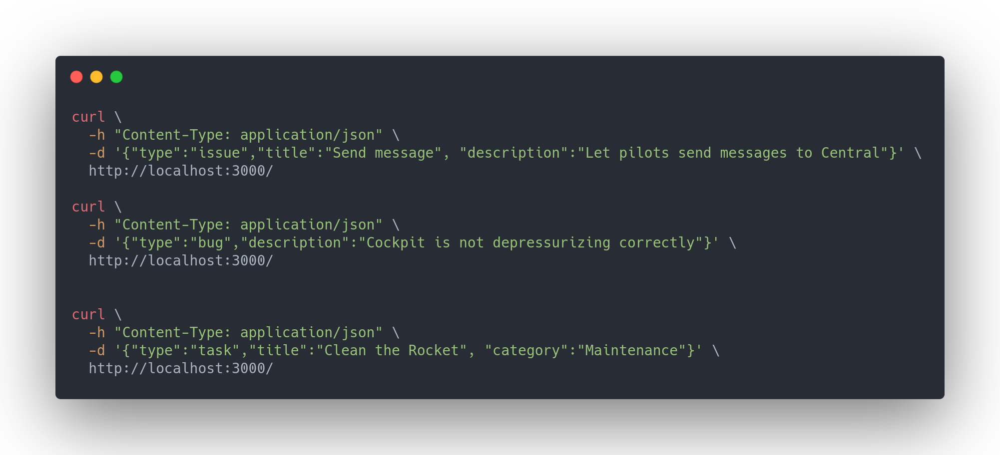

# Space-X challenge

FastAPI offline challenge ([Challenge requirements](https://doc.clickup.com/459857/d/h/e12h-61863/14674106a2a38cc)).


### System Requirements

* [Docker](https://docs.docker.com/engine/install/)
* [Docker-compose](https://docs.docker.com/compose/install/)
* [Git](https://git-scm.com/book/en/v2/Getting-Started-Installing-Git)

### Run application (with Docker compose)

```shell
git pull https://github.com/Abrunacci/space_x_challenge.git
cd space_x_challenge
docker compose build
docker compose up -d
```

### End application

```shell
docker compose down
```

### Run tests

```shell
docker compose up -d
docker compose exec api pytest . -v --cov-report  --cov
docker compose down
```

# API Test Coverage:

```shell

```

# API Endpoints

### [GET] http://0.0.0.0:3000/docs

    Redirects to API documentation.

    curl 'http://0.0.0.0:3000/docs'

### [GET] http://0.0.0.0:3000/

    Redirects to API documentation.

    curl 'http://0.0.0.0:3000/'

According to this image provided in the challenge, we should perform all the requests with GET.


